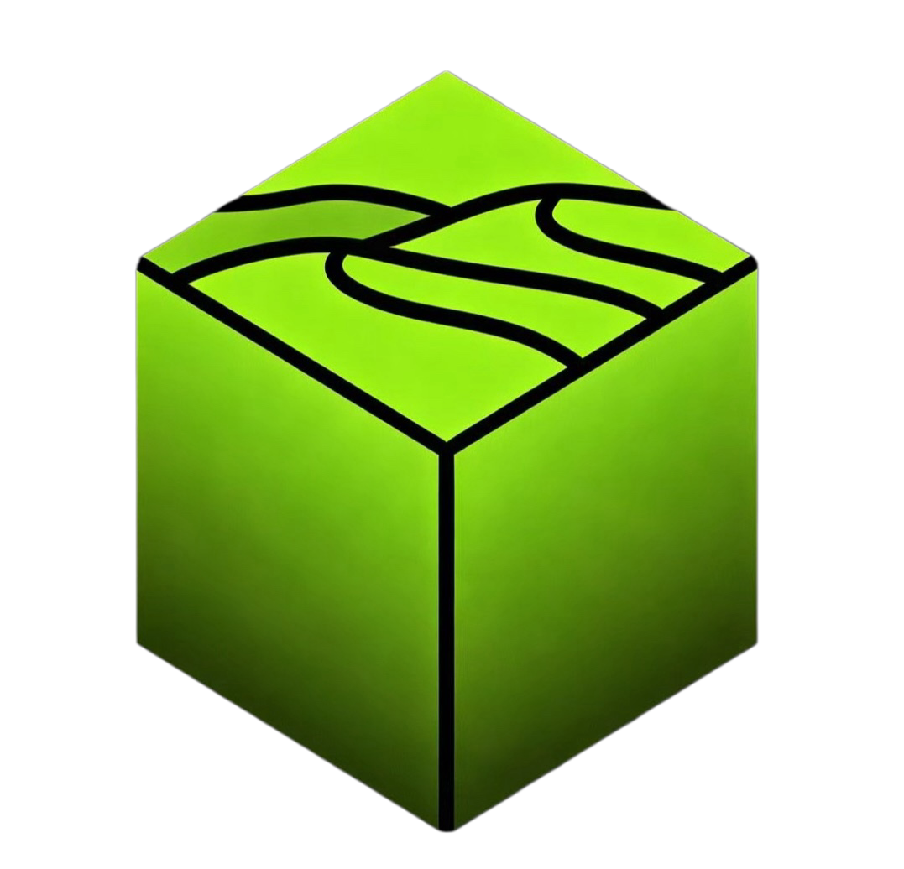

  <table align="center" cellspacing="0" cellpadding="0">
    <tr border="0"> 
      <td valign="middle" border="0"></td>
      <td valign="middle" border="0"><h1>&nbsp;Oas AI Studio</h1></td>
    </tr>
  </table>
  
Building the next generation of AI tools.

  
Open-source, lightweight, and provider-agnostic solutions for developers.

---

## Our Projects

- **[Symphony TS](https://github.com/OasAIStudio/symphony-ts)** - TypeScript implementation of [OpenAI Symphony](https://github.com/openai/symphony). Allowing teams to manage work instead of supervising coding agents.
- **[Open Agent SDK](https://github.com/OasAIStudio/open-agent-sdk)** - Open-source alternative to Claude Agent SDK
- **[ClawPiggy](https://github.com/OasAIStudio/ClawPiggy)** - Agent-to-Agent token recycling platform

## Links

- **Website**: [oasai.studio](https://oasai.studio)
- **GitHub**: [github.com/OasAIStudio](https://github.com/OasAIStudio)
- **X (Twitter)**: [@OasAIStudio](https://x.com/oasaistudio)